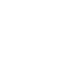

# Ultramegakrutoy-project
Ultramegakrutoy project, meme finder

// function fullscreen(el) {
//     console.log(el.name)
//     const mDiv = el.closest('.meme');
//     const imgs = mDiv.querySelectorAll('img');
//     const img = imgs[imgs.length - 1];
//     const src = img.src;

//     const fsDiv = document.createElement('div');
//     fsDiv.id = 'img-fs';
//     fsDiv.className = 'img-fs';
//     fsDiv.innerHTML = ``;
//     document.body.appendChild(fsDiv);

//     if (fsDiv.innerHTML != '') {
//         fsDiv.addEventListener('click', () => {
//             fsDiv.remove()
//         })
//         document.addEventListener('keydown', (e) => {
//             if (e.key === 'Escape') {
//                 fsDiv.remove();
//             }
//         });
//     }
// }

// function fullscreen(el) {
//     console.log(el.name)
//     const mDiv = el.closest('.meme');
//     const videos = mDiv.querySelectorAll('video');
//     const video = videos[videos.length - 1];
//     const src = video.src;

//     const fsDiv = document.createElement('div');
//     fsDiv.id = 'img-fs';
//     fsDiv.className = 'img-fs';
//     fsDiv.innerHTML = `<video controls class="img-fs-content" src="${src}" type="video/mp4" alt="">`;
//     document.body.appendChild(fsDiv);

//     if (fsDiv.innerHTML != '') {
//         fsDiv.addEventListener('click', () => {
//             fsDiv.remove()
//         })
//         document.addEventListener('keydown', (e) => {
//             if (e.key === 'Escape') {
//                 fsDiv.remove();
//             }
//         });
//     }
// }

// const memeContainer = document.querySelector('.meme-container')
// for (let i = 0; i<=39; i++) {
//     const memeDiv = document.createElement('div');
//     memeDiv.className = "meme"
//     memeDiv.innerHTML = `

//                             <a href="images/AsphaltTexture.jpg" download>
//                                 
//                             </a>
//                             <a class="fullscreen-icon" href="#img-fs" onclick="fullscreen(this)">
//                                 
//                             </a>
//                         

//                         `
//     memeContainer.appendChild(memeDiv);
// }